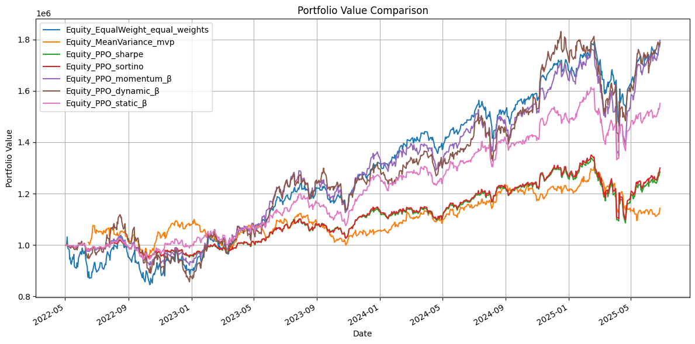
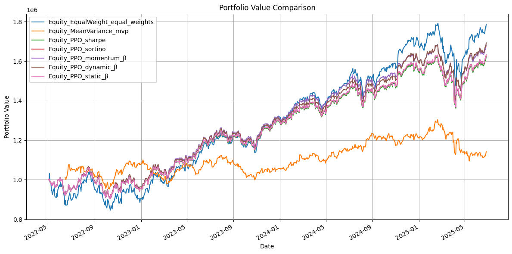
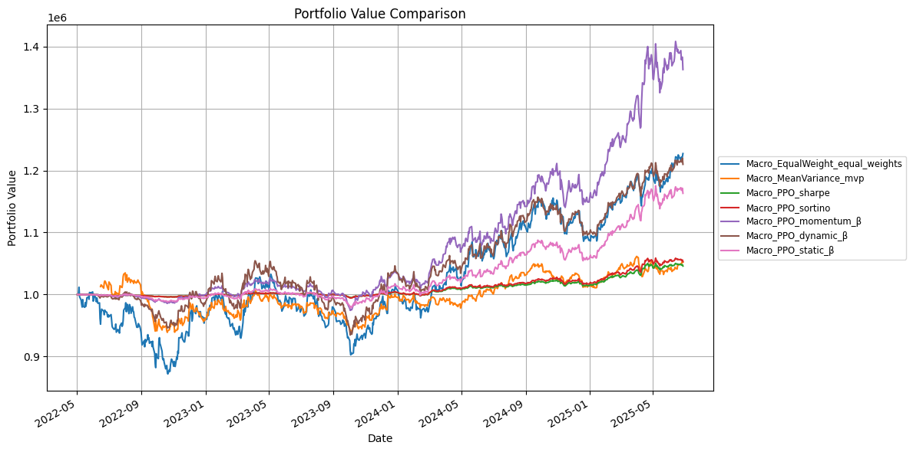
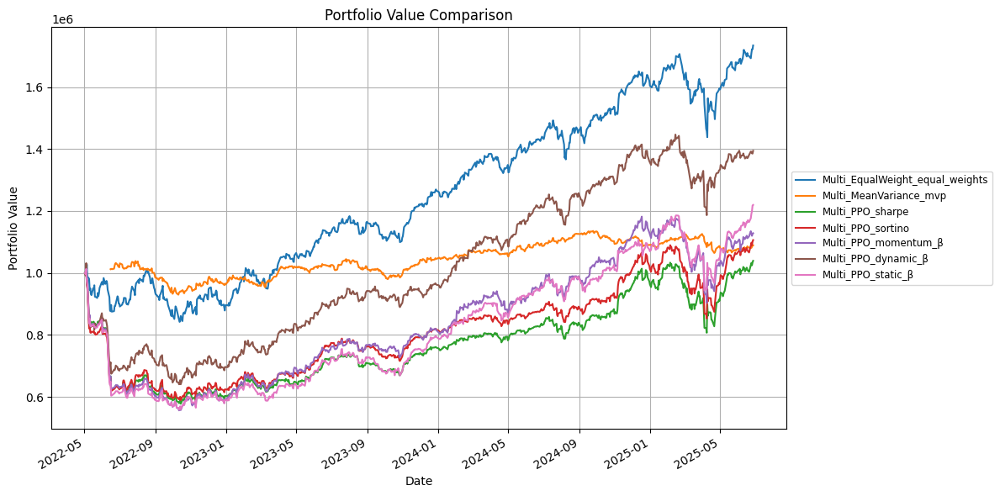

# Factor-Based Deep Reinforcement Learning for Asset Allocation: Comparative Analysis of Static and Dynamic Beta Reward Designs

Introduction
---
This repository accompanies the study:
"Factor-Based Deep Reinforcement Learning for Asset Allocation: Comparative Analysis of Static and Dynamic Beta Reward Designs"

Motivated by limitations in return-only reward functions in portfolio optimization, this project introduces a reinforcement learning framework that incorporates time-varying factor exposure (e.g., momentum, volatility, volume) into both the state representation and reward design. The framework compares seven reward structures:

- Equal Weights
- Mean Variance
- Sharpe Ratio Reward
- Sortino Ratio Reward
- Momentum-β Reward
- Static-β Reward
- Dynamic-β Reward

Experiments are conducted using Proximal Policy Optimization (PPO) on multi-asset datasets including equities, crypto, macro assets, and multi-asset portfolios, over long historical horizons.

Using the Environment
---
This project is designed for Google Colab and supports end-to-end experimentation on portfolio management using reinforcement learning.

Main Components
- main.ipynb: Colab notebook to train/test PPO models with different reward designs.

Descriptive Statistics
---

### Multi Asset Train Period (2015-01-02 ~ 2022-04-29)
**Trading Days:** 1,845 (70.0%)  

| Ticker   | Count   | Mean     | Std      | Min      | 25%      | 50%      | 75%      | Max       |
|----------|---------|----------|----------|----------|----------|----------|----------|-----------|
| AAPL     | 1845.0  | 63.5308  | 44.9641  | 20.6475  | 28.3542  | 43.2791  | 88.6624  | 178.6456  |
| AMZN     | 1845.0  | 86.0640  | 51.4040  | 14.3475  | 38.6220  | 82.8110  | 137.7290 | 186.5705  |
| BA       | 1845.0  | 222.0793 | 89.1122  | 95.0100  | 133.7385 | 208.3400 | 320.2827 | 430.3000  |
| BTC-USD  | 1845.0  | 12559.8895 | 16774.0070 | 178.1030 | 704.3760 | 6639.1401 | 11322.1230 | 67566.8281 |
| DIA      | 1845.0  | 218.4911 | 60.9017  | 127.9687 | 155.3648 | 216.8293 | 253.8773 | 344.9316  |
| DIS      | 1845.0  | 118.0308 | 27.8162  | 82.4504  | 97.7316  | 107.0026 | 134.1372 | 198.5992  |
| GLD      | 1845.0  | 135.7762 | 24.3751  | 100.5000 | 117.2900 | 124.3600 | 162.3500 | 193.8900  |
| GOOGL    | 1845.0  | 64.2812  | 32.7287  | 24.7048  | 40.0215  | 55.0001  | 73.5136  | 148.9452  |
| IEF      | 1845.0  | 94.1352  | 7.6994   | 83.7359  | 87.4013  | 90.7012  | 101.7175 | 109.4531  |
| INTC     | 1845.0  | 38.8853  | 10.4100  | 20.3024  | 28.6505  | 40.9945  | 46.8853  | 62.0833   |
| JNJ      | 1845.0  | 111.3771 | 24.1879  | 69.2167  | 92.5680  | 110.6248 | 127.7236 | 168.7964  |
| JPM      | 1845.0  | 86.6236  | 30.7800  | 40.8551  | 54.4398  | 86.4842  | 101.7132 | 155.4105  |
| KO       | 1845.0  | 38.8731  | 7.2422   | 27.6990  | 32.8575  | 37.0763  | 44.5169  | 60.0824   |
| META     | 1845.0  | 183.2342 | 74.9105  | 73.6460  | 124.3180 | 173.2495 | 216.7509 | 380.0948  |
| MSFT     | 1845.0  | 125.5750 | 84.3969  | 34.5583  | 53.2935  | 98.4196  | 192.8626 | 333.1555  |
| NFLX     | 1845.0  | 292.0729 | 168.0659 | 45.5471  | 123.3500 | 300.6900 | 406.2700 | 691.6900  |
| NVDA     | 1845.0  | 7.2284   | 7.4043   | 0.4593   | 1.7205   | 4.6796   | 9.4987   | 33.3111   |
| PG       | 1845.0  | 88.1453  | 26.9690  | 51.5939  | 65.6264  | 74.6642  | 109.6179 | 150.4982  |
| QQQ      | 1845.0  | 188.2067 | 87.7096  | 89.8063  | 110.7672 | 163.1031 | 243.2370 | 394.3982  |
| SLV      | 1845.0  | 17.3515  | 3.5519   | 11.2100  | 14.8800  | 16.0500  | 19.1000  | 27.0000   |
| SPY      | 1845.0  | 261.8122 | 81.6968  | 155.8698 | 188.0715 | 244.7464 | 302.4662 | 454.4669  |
| TIP      | 1845.0  | 94.3801  | 8.7273   | 83.3248  | 88.2454  | 89.7124  | 102.3400 | 113.4396  |
| TLT      | 1845.0  | 110.8825 | 15.8319  | 88.2493  | 98.4755  | 103.1778 | 123.1514 | 148.6342  |
| TSLA     | 1845.0  | 75.0621  | 102.2000 | 9.5780   | 15.7867  | 20.9380  | 74.6420  | 409.9700  |
| UNH      | 1845.0  | 224.3037 | 104.8663 | 84.0055  | 124.9830 | 217.0791 | 278.3788 | 518.5569  |
| V        | 1845.0  | 135.1448 | 56.1099  | 57.2355  | 76.6705  | 131.0597 | 189.6195 | 243.6303  |
| WMT      | 1845.0  | 30.4495  | 9.9226   | 15.6126  | 20.8832  | 28.6357  | 39.8912  | 50.9988   |
| XOM      | 1845.0  | 53.1609  | 9.1275   | 24.5830  | 51.1806  | 55.2828  | 58.2462  | 79.0833   |

---

### Multi Asset Test Period (2022-05-02 ~ 2025-06-27)
**Trading Days:** 792 (30.0%)  

| Ticker   | Count   | Mean     | Std      | Min      | 25%      | 50%      | 75%      | Max       |
|----------|---------|----------|----------|----------|----------|----------|----------|-----------|
| AAPL     | 792.0   | 183.8585 | 32.3811  | 123.4213 | 156.3833 | 181.2653 | 211.3075 | 258.3967  |
| AMZN     | 792.0   | 152.7578 | 41.7515  | 81.8200  | 116.0825 | 145.8450 | 186.4450 | 242.0600  |
| BA       | 792.0   | 183.6264 | 29.0968  | 115.8600 | 162.0875 | 182.6300 | 205.7625 | 264.2700  |
| BTC-USD  | 792.0   | 49390.9594 | 28459.6425 | 15787.2842 | 25825.1890 | 37869.5371 | 67917.6445 | 111673.2812 |
| DIA      | 792.0   | 359.5281 | 47.2273  | 273.3334 | 320.7730 | 344.4039 | 402.5504 | 445.9341  |
| DIS      | 792.0   | 98.2644  | 10.4382  | 78.0194  | 90.3095  | 96.9734  | 107.7699 | 122.9110  |
| GLD      | 792.0   | 205.5831 | 42.5578  | 151.2300 | 173.8125 | 187.1350 | 233.9200 | 316.2900  |
| GOOGL    | 792.0   | 137.8066 | 30.7859  | 82.9326  | 110.9964 | 135.7608 | 164.8655 | 205.8933  |
| IEF      | 792.0   | 90.4175  | 2.6096   | 83.2667  | 88.6824  | 90.4382  | 92.5475  | 95.8498   |
| INTC     | 792.0   | 30.3328  | 7.6485   | 18.1300  | 23.9720  | 29.9236  | 35.0869  | 50.0892   |
| JNJ      | 792.0   | 152.6015 | 6.7831   | 137.7182 | 148.1772 | 152.4500 | 157.2816 | 166.7964  |
| JPM      | 792.0   | 169.4522 | 51.4010  | 95.1554  | 127.3482 | 150.1160 | 207.9168 | 287.3656  |
| KO       | 792.0   | 60.0045  | 5.4555   | 49.7033  | 56.3486  | 58.3107  | 62.1681  | 73.3783   |
| META     | 792.0   | 371.8464 | 183.5961 | 88.4249  | 191.0395 | 330.9146 | 525.1694 | 735.4493  |
| MSFT     | 792.0   | 347.5838 | 75.9892  | 209.3933 | 269.4037 | 365.1847 | 414.0875 | 497.4500  |
| NFLX     | 792.0   | 545.8168 | 280.1913 | 166.3700 | 322.4450 | 466.4300 | 695.9150 | 1323.1200 |
| NVDA     | 792.0   | 68.4481  | 47.0773  | 11.2142  | 21.9290  | 48.1305  | 117.0002 | 157.7500  |
| PG       | 792.0   | 148.6485 | 14.1351  | 114.7211 | 137.9442 | 146.3311 | 161.9682 | 176.2988  |
| QQQ      | 792.0   | 392.2694 | 87.2132  | 255.8906 | 305.0294 | 384.7218 | 473.7189 | 548.0900  |
| SLV      | 792.0   | 23.5965  | 4.1782   | 16.3800  | 20.5875  | 22.1100  | 27.4825  | 33.7400   |
| SPY      | 792.0   | 469.6762 | 81.6182  | 343.1389 | 394.4251 | 444.9231 | 548.9910 | 614.9100  |
| TIP      | 792.0   | 103.0759 | 3.0875   | 96.9804  | 100.8219 | 102.6711 | 105.7446 | 109.5123  |
| TLT      | 792.0   | 91.0268  | 5.9402   | 76.7679  | 86.8438  | 89.7644  | 94.7012  | 107.3878  |
| TSLA     | 792.0   | 241.0570 | 65.0909  | 108.1000 | 191.7975 | 235.8850 | 269.6550 | 479.8600  |
| UNH      | 792.0   | 491.8596 | 55.0926  | 272.4162 | 470.3069 | 492.7936 | 518.7108 | 615.8387  |
| V        | 792.0   | 256.2685 | 49.0832  | 173.9413 | 218.0557 | 251.4155 | 280.4247 | 373.3100  |
| WMT      | 792.0   | 61.5137  | 18.7950  | 37.8719  | 47.2976  | 52.8062  | 78.0749  | 104.5096  |
| XOM      | 792.0   | 102.2846 | 10.1172  | 75.0122  | 97.2676  | 103.4963 | 109.5824 | 122.1211  |

Result
---

- Equity Asset (PPO)
  

  
  

- Crypto Asset (PPO)
  

  
  

- Macro Asset (PPO)
  

  
  

- Multi Asset (PPO)
  

  
  

- Multi Asset (SAC)

- Multi Asset (TD3)

Setup
---

